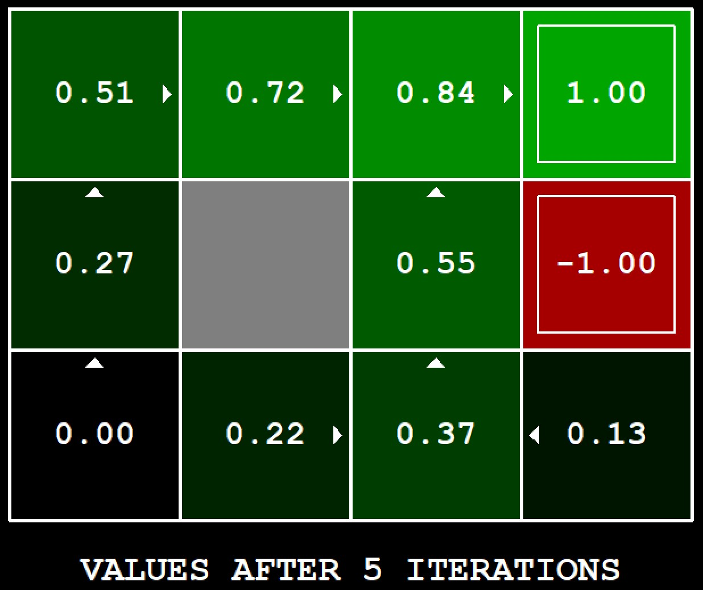
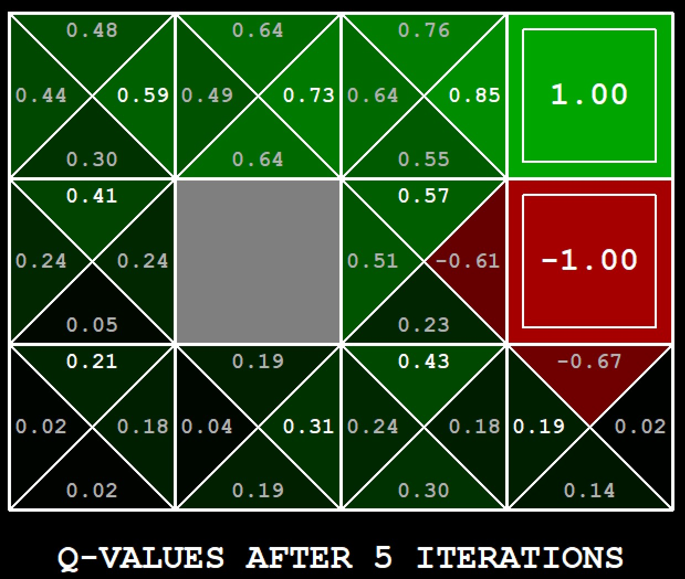




# [EI-Wiki](..)/[AI](Home)/Lab 2 - Reinforcement Learning

## Inhoudstafel

* [Intro](#introductie)
* [Opgave 1](#opgave-1)
* [Opgave 2](#opgave-2)
* [Opgave 3](#opgave-3)
* [Opgave 4](#opgave-4)
* [Opgave 5](#opgave-5)
* [Opgave 6](#opgave-6)
* [Opgave 7](#opgave-7)
* [Opgave 8](#opgave-8)

## Introductie

Dit deel van de wiki gaat over de opdrachten van lab 2 (practicumsessies 3 & 4).

[Opgave](https://inst.eecs.berkeley.edu/~cs188/fa18/project3.html)

Gelieve de opgaven steeds in volgorde uit te voeren, aangezien deze soms gebruikmaken van vorige opgaven.

In gridworld zal de agent niet altijd de move doen die aan de agent gezegd is. Het kan zijn dat hij 80% van de tijd wél doet wa hij moet doen en 20% van de tijd de verkeerde kant opgaat. Hier zal dus ook rekening mee gehouden moeten in het algoritme.

### MDP

MDP staat voor Markov Decision Process 

MDP komt overeen met `problem` van lab1
<!--TODO: Wat is MDP?--->

Handige functies:
* mdp.getStates()
    * Returnt alle mogelijke states in het probleem
* mdp.getPossibleActions(state)
    * Returnt alle mogelijke acties die kunnen uitgevoerd worden door de actor in `state`
* mdp.getTransitionStatesAndProbs(state, action)
    * Returnt een lijst van tuples met de nieuwe state en de kans dat je in die state komt
* mdp.getReward(state, action, nextState)
    * Geeft de reward van de actie
* mdp.isTerminal()
    * Boolean die laat weten of je in een terminal state bent

## Opgave 1

$$
V_{k+1}\left(s\right) \leftarrow  \max_{a} \sum_{s'}{T\left(s,a,s'\right)\left[ R\left(s,a,s'\right) + \gamma V_{k}\left(s'\right) \right]} 
$$

In deze opgave moet je `ValueIterationAgent()` afwerken, zodat de values worden bepaald voor de kaart.

Je kan best beginnen bij `runValueIteration()`, daar moet je bovenstaande formule implementeren.

ALs dat in orde is, moet je nog twee functies afwerken: 
* `computeActionFromValues(state)`: bepaalt de te nemen actie op basis van values
* `computeQValueFromValues(state, action)`: returnt de Q-waarde adhv de values

De volgende commando's zullen 3 schermen tonen waar je tussen kan switchen door op een toets te duwen.



Hier kan je de values zien per vakje. De pijltjes zijn het resultaat van de `computeActionFromValues`



Als je dan op een toets duwt, krijg je de Q-waarden.

Het laatste scherm zal de agent tonen terwijl hij het probleem oplost met de gekende data.

### Commando's om te zien of alles werkt

```
python gridworld.py -a value -i 100 -k 10
python gridworld.py -a value -i 5
python autograder.py -q q1
```

### Een aantal tips

#### Volg de formule

Voor `runValueIteration()` moet je gewoon de formule implementeren. Hieronder staat deze in pseudocode:

