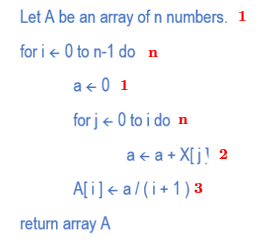
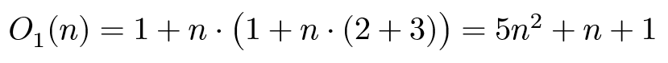

# [EI-Wiki](..)/[Datastructuren](Datastructuren/Home)/Opgave 1
1. Bereken de Big O voor beide algoritmes
    * Bereken de tijdscomplexiteit voor elke instructie

    

    * Daarna tel en vermenigvuldig je correct

    

2. Implementeer de pseudo code in java
    * Arrays worden als volgt aangemaakt
    
```java
// Maak een nieuwe int array aan met lengte 'n'
int[] intArr = new int[n];
```
3. Creëer een random array generator.

```java
// Creëer een random object
Random rand = new Random();

// Genereer een eerste random getal
int r1 = rand.nexInt();

// Genereer een tweede random getal
int r2 = rand.nexInt();
```

4. Bepaal de nodige tijd om het algoritme uit te voeren. Met één van de methodes `System.nanoTime()` of `System.currentTimeMillis()`. Gebruik hiervoor volgende formule: `dt=t1-t0`.

5. Bepaal de tijd voor 'n' unieke arrays met een vaste lengte
6. Bepaal de tijd voor 'n' unieke arrays met een groeiende lengte
7. Giet al je bekomen waardes in een excel bestand en voeg deze toe aan je portfolio of verslag (pdf document).
