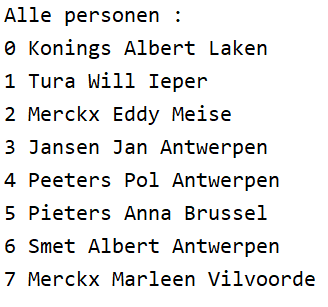
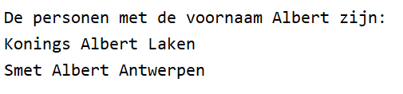
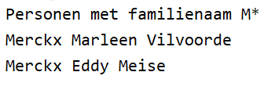
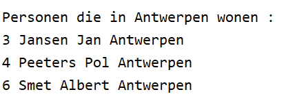


# [EI-Wiki](..)/[Datastructuren](Home)/Opgave 4
## 0. Extra info
### 0.1 Project aanmaken
In IntelliJ maak een nieuw project an gebruik als template (2de pagina) een 'Console Application'.

### 0.2 Opgepast!
Alle opdrachten moeten gemaakt worden met een iterator en NIET standaard for lussen.

## 1. Lees bestand en ArrayList/Linked List
Lees het gegeven bestand in uw programma in. Maak daarna een ArrayList van dit bestand door middel van een zelfgemaakte klasse `Persoon`.

## 2. Afdrukken alle personen
We schrijven nu een method om alle personen af te drukken. We doen dit door gebruik te maken van een iterator (zie [0.2](#02-opgepast)). De afdruk moet er uit zien als volgt:

## 3. Afdrukken personen met voornaam XXX
Druk nu alle personen in de list af die de voornaam 'Albert' hebben of een andere. We kunnen dit doen door een argument mee te geven met de method.

## 4. Afdrukken personen met achternaam X*
Druk alle personen af met een achternaam die begint met de letter 'M' (argument). Je drukt deze namen af in omgekeerde volgorde waarin ze voorkomen.

## 5. Afdrukken personen met woonplaats XXX
Maak een lijst aan met de indices van alle personen die in 'Antwerpen' (argument) wonen.
Vervolgens loop je door deze nieuwe list en gebruik je de get methode van de oude list om de persoon af te drukken.

