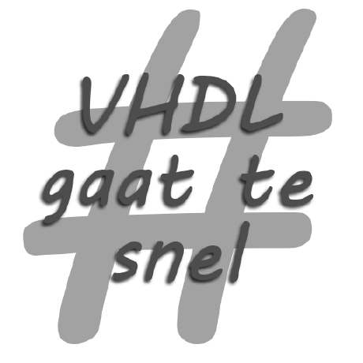

# [EI-Wiki](..)/Digitale Elektronica

## Inhoudsopgave
* [Regels](Regels)
* [Vivado](Vivado)
* [Syntax](Syntax)
* [Types](Types)
    * [Type Conversies](Type-Conversies)

## Handige Links
* [Hendrik Valcke zijn projecten](https://github.com/Hendrik-Valcke/1-Digitale-Elektronica)

* [Mathias Maes zijn projecten](https://github.com/WatcherWhale/DigitalElectronics)