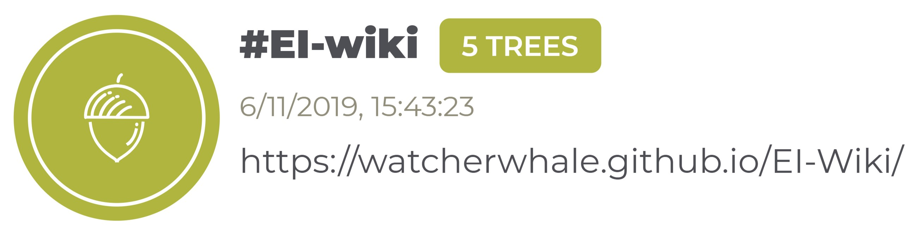

# EI-Wiki
## ❗️ De EI-Wiki is verhuist ❗️
**OPGEPAST**: We zijn verhuist. Je kan nu nog enkel naar de wiki surfen via [www.eiwiki.ga](https://www.eiwiki.ga).

## Introductie
Na veel verwarring in het eerste jaar hebben een paar geëngageerde studenten besloten om een wiki te maken. De wiki waarop u zich nu bevindt. Hier kan je alles vinden over onze specifieke vakken.

Natuurlijk ga je hier niet de oplossingen voorgekauwd krijgen. Je zal dus nooit de oplossing krijgen, maar enkel een antwoord op je vraag.
Op de EI-Wiki is enkel informatie beschikbaar over dingen die we kunnen googlen of vinden op ons opgave blad.
We doen dit zodat je niet verdwaald in de over gecompliceerde antwoorden die op het internet te vinden vallen.

## Onderhouders Gezocht
De EI-Wiki zoekt nog onderhouders voor de 1ste, 3de bachelor en de master. Voel jij je geschikt om mee te werken, aarzel dan niet om iemand van de onderhouders aan te spreken.

## Onderhouders
* [Mathias Maes](https://github.com/WatcherWhale)
* [Hendrik Valcke](https://github.com/Hendrik-Valcke)
* [Tijs Van Alphen](https://github.com/TissieVA)
* [Pierre Franck](https://github.com/pixar02)
* [Tom De bruyn](https://github.com/TomD011099)
* [Wout Van Uytsel](https://github.com/Wocco)

## Zelf meewerken?
Als je een kleine opmerking hebt of een spelfout vond, kan je altijd een [issue](https://github.com/WatcherWhale/EI-Wiki/issues) openen.

Voor meer uitleg ga naar de [Meewerken](Meewerken) pagina.

## EI-Wiki 4 Teamtrees

## Ter info
Bouwkunde is stom! 
